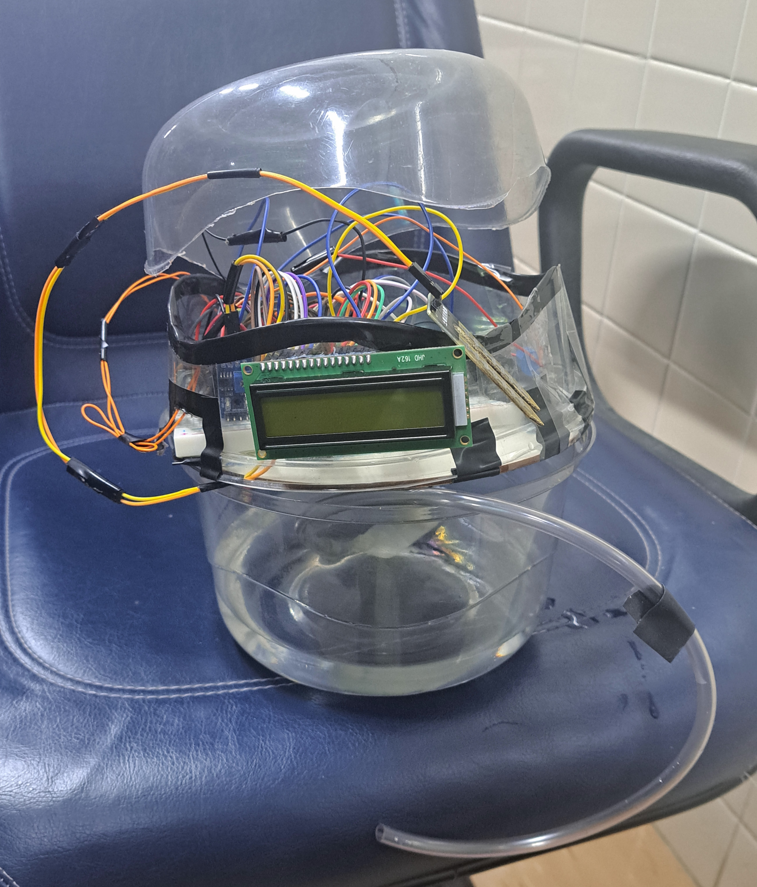
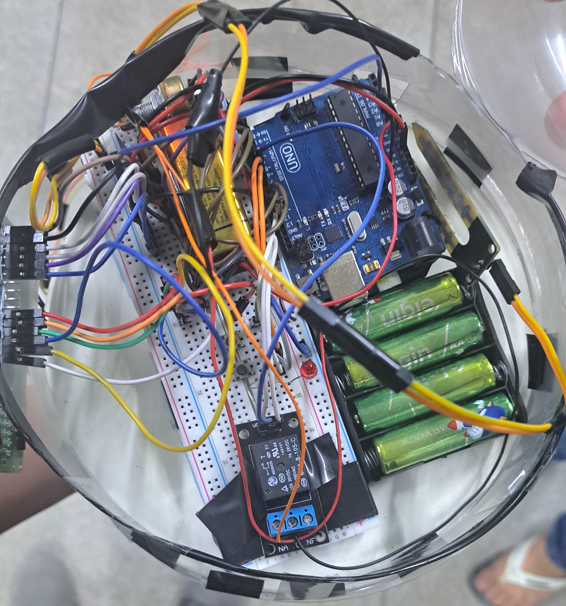

# Robotics Irrigation Project

This was a fun straight foward irrigation project using Arduino UNO and several eletronics coponents that I've learned to utilize during this simester. The Ideia came within talking to my partner in the project [@tarsilaAmado](https://github.com/tarsilaAmado) and our dear Robotics professor Wilmer yecid Cordoba. Moreover, I would like to point out that the project evolution was documentated in our Academic Progress Report, you can find the original portuguese version as well as the english translated version attached to this repository.

## Introduction and Description

This project aims to develop an automated irrigation system designed to simplify plant care, particularly for people with busy routines or for the elderly who can benefit from contact with nature. Using Arduino and a series of electronic components, the system monitors soil moisture and triggers irrigation in a personalized and efficient way.

The robot is designed with two main sections: the upper and lower parts. The upper section houses the entire electronic circuit and system, including an LCD display that allows real-time monitoring of the planter’s soil moisture. The lower section serves as the water reservoir, designed for easy access. To refill it, simply slide the upper part aside, providing a convenient and user-friendly way to maintain the system.

This robot is affectionately named "Egg" due to its unique design. When the upper section is opened for access and modifications to the electronics, the robot resembles a cracked egg, which led to the playful nickname.

  
  

With the ability to adjust the irrigation frequency (high, daily, and every two days), the system ensures that plants receive the ideal amount of water, avoiding both excessive and insufficient irrigation. This project combines simplicity and accessible technology to promote well-being and improve quality of life.

## Future Improvements

The proposal is to expand the project in the future with the addition of additional sensors and remote connectivity, problably using ESP-32, enabling remote control and monitoring via mobile devices. 

The code and implementation details are available here to facilitate replication and customization of the system.
